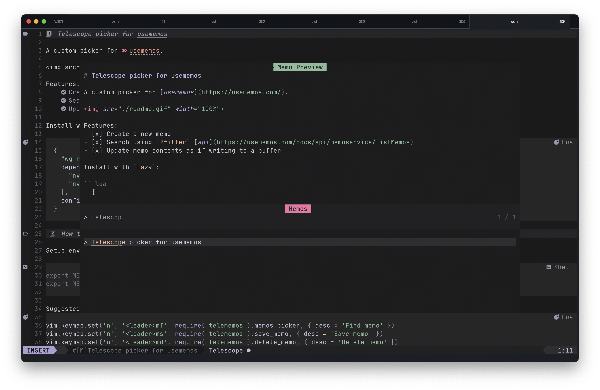

# Telescope picker for usememos

A custom picker for [usememos](https://usememos.com/).



Features:
- [x] Create a new memo
- [x] Search using `?filter` [api](https://usememos.com/docs/api/memoservice/ListMemos)
- [x] Update memo contents as if writing to a buffer
- [x] Delete memo (unlink buffer)

Install with `Lazy`:

```lua
  {
    "wg-romank/telememos.nvim",
    dependencies = {
      "nvim-telescope/telescope.nvim",
      "nvim-lua/plenary.nvim",
    },
    config = true
  }
```

## How to use

Setup environment variables for your instance.

```bash
export MEMOS_URL="https://memos.vpn"
export MEMOS_TOKEN="eyJhbGciOi....."
```

Suggested keymaps:
```lua
vim.keymap.set('n', '<leader>mf', require('telememos').memos_picker, { desc = 'Find memo' })
vim.keymap.set('n', '<leader>ms', require('telememos').save_memo, { desc = 'Save memo' })
vim.keymap.set('n', '<leader>md', require('telememos').delete_memo, { desc = 'Delete memo' })
```

Opening memo with `<leader>mf` will create `autocmd` for that buffer so it will be linked to memo on your instance. Saving buffer will trigger command to update `contents` on the instance.

You can also `<leader>ms` on any of your buffers, this will call `POST` endpoint on the instance and save its contents. `default_state` and `default_visibility` parameters will be used to set respective API fields. See section below how to override this behavior.

Any buffer bound with a memo can use `<leader>md` to delete memo from the instance and 'unlink' it.

## Customization

Options to override:
- `debounce_ms` - how long to wait for picker input before searching
- `min_characters` - how many characters to wait for before searching
- `default_visibility`, `default_state` - as specified in create [API](https://usememos.com/docs/api/memoservice/CreateMemo)
- `name_prefix` - buffer name prefix, default is `[M]` to distinguish between files and buffers linked to memos
- `max_header_length` - buffer name cap, name is generated from memo contents when you link buffers with `save_memo` command
- `default_layout` - your telescope picker [layout](https://github.com/nvim-telescope/telescope.nvim?tab=readme-ov-file#layout-display) configuration

To actually override options pass them as `config` parameter.

```lua
  config = {
    name_prefix = '[M]',
    max_header_length = 20,
    default_visibility = 'PUBLIC',
    default_state = 'STATE_UNSPECIFIED',
    debounce_ms = 250,
    min_characters = 3,
    default_layout = {
      previewer = true,
      layout_strategy = 'vertical',
      layout_config = {
        width = 0.8,
        preview_cutoff = 0,
        height = 0.8,
        prompt_position = "top",
      },
      sorting_strategy = "ascending",
    }
  }
```

## Todos

- [ ] Open new buffer & save as memo as a single command
